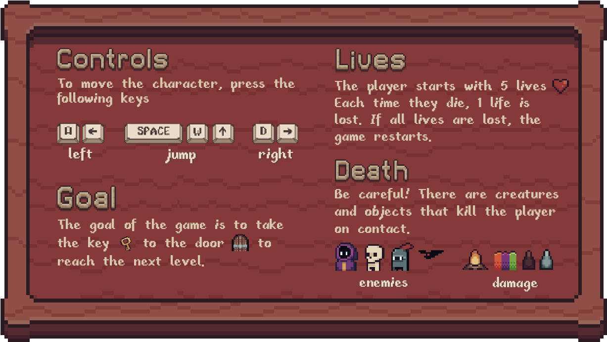
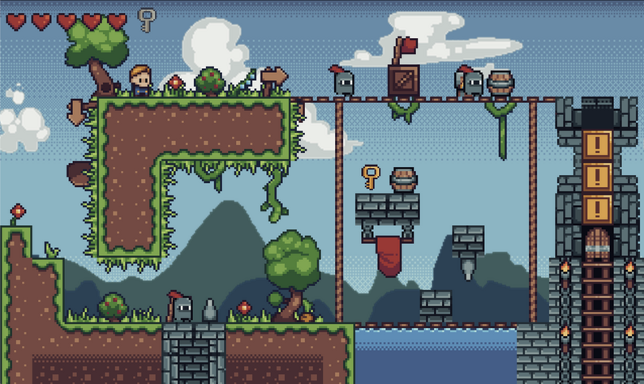
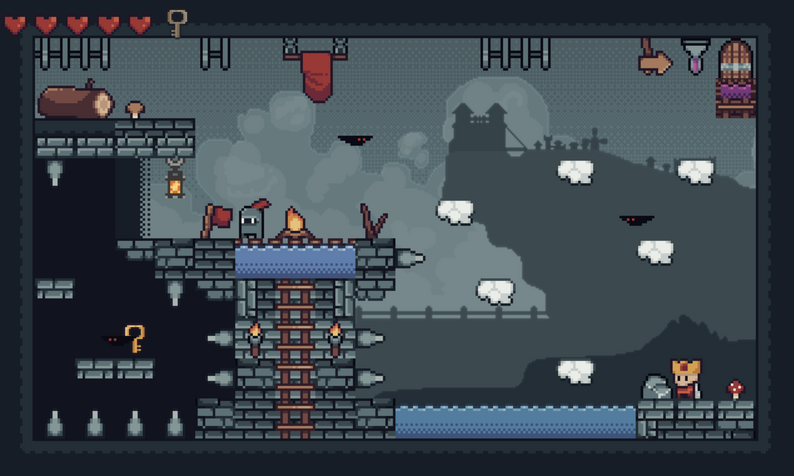

# Jogo - The Lost Key
## Sobre o Jogo
The Lost Key é um jogo de plataforma criado com Pygame para a disciplina de Programação Orientada a Objetos II - UFSC 2023.2. Mais informações sobre o jogo e como jogar nas imagens abaixo.

<div align="center">
    
</div>

<div align="center">
    
<div>

<div align="center">
    
<div>

## Como instalar e rodar o jogo

### ❗️❗️ Aviso Importante: Nesse momento, Python 3.13 ou superior não receberam suporte do pygame. ❗️❗️ 

Para executar o jogo, é necessário que o usuário tenha Python <=3.13 instalado na máquina e as dependências (pygame e pytmx).
Com o python instalado, vá ao terminal do computador aberto na pasta do jogo e escreva:


  
### Mac e Linux

```sh
pip3 install -r requirements.txt
```
```sh
python3 main.py
```
### Windows
```sh
pip install -r requirements.txt
```
```sh
python main.py
```
